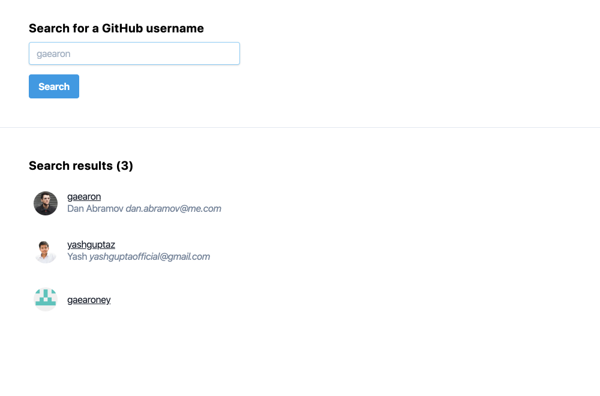

# GitHub User Activity

A React applications to search and display user activity on GitHub.

## Running

1. Install dependencies: `yarn`
1. Starting: `REACT_APP_GITHUB_TOKEN="<Your personal access token>" yarn start`

## Testing

1. Running unit tests `yarn test`
1. Running integration tests `yarn cy:run`

## User Stories

### Scenarios

#### Searching

*As a:* User

*I want:* to be able to search GitHub by user name and display a list of matches.

*So that:* I can find my friends.

#### Displaying a user

*As a:* User

*I want:* to see a user's avatar.

*So that:* I can recognise my friends.

#### Displaying user's activities

*As a:* User

*I want:* to see information about a user's activity.

*So that:* I can understand their commit history.

