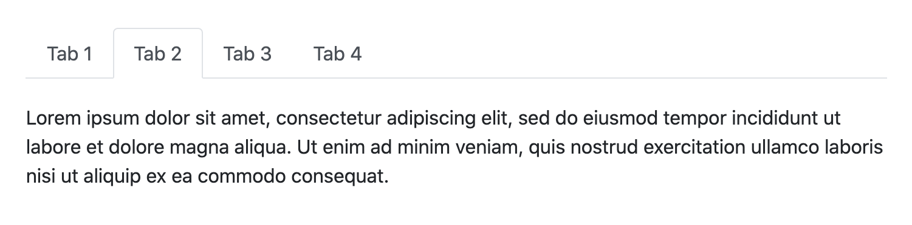

# Coding Kata

Without a framework, use HTML, JavaScript and CSS to create a document that fetches data asynchronously and concurrently, then renders it matching the following design and API below.

Note: you may use a testing framework if you wish.

## API

```js
// Rendering API
createElement(
  type,
  { props },
  ...children
)

render(element, container)

// Example usage/pseudo code
const App = async () => {
  const [tabData, contentData] = await fetchTabsWithFirstPage();

  const tabs = createElement('nav', {}, renderTabs(tabData));
  const content = createElement('article', { id: 'content' }, contentData);

  return createElement('main', {}, tabs, content);
};

render(await App(), container);
```

## Design


