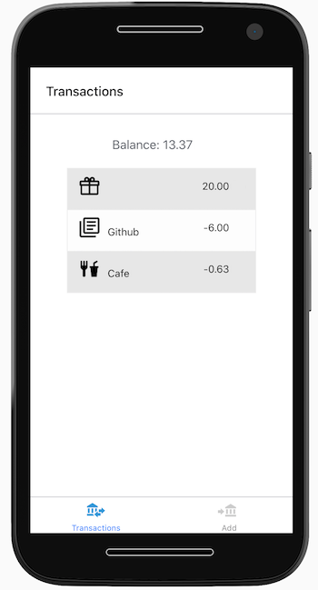

# Blockchain Transactions Example React Native app

A Blockchain transaction history viewer and account manager example app built using React Native, Expo, TypeScript, and Jest.

## Running

Assuming Node, yarn and Docker is already installed (and optionally Android Studio and Xcode to run on a virtual mobile device).

### API

1. Start the transactions API
1. Edit `constants/config.ts` to set the hostname (if different from `localhost`)

### App

1. Install dependencies: `yarn`
1. `yarn start`
1. Once prompted, press `a` for Android emulator, or `i` for iOS simulator, or `w` to launch in a browser.

## Testing

Use `yarn test` to run the Jest tests.

## Screenshot

