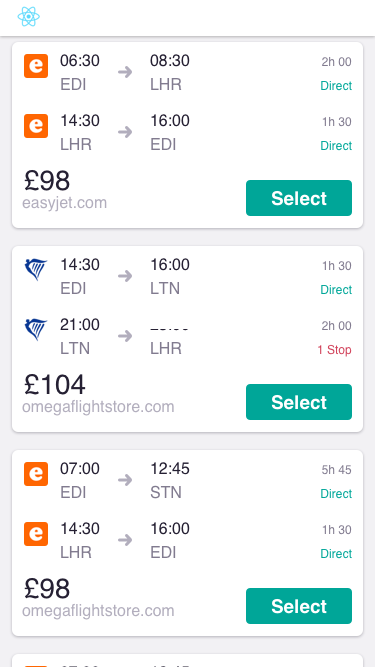

# Flight Itineraries

A React application that takes data from [flights.json](public/flights.json) and renders it matching a given [design](designs/results-small.png).

## Running

* `yarn start` - Start in development mode
* `yarn test` - Run tests

## Screenshot

